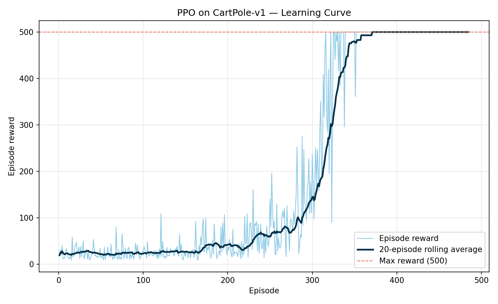

# CartPole Balancing with PPO (Stable-Baselines3)

Assignment 1 — trains a PPO agent to solve the `CartPole-v1` Gymnasium
environment using Stable-Baselines3, evaluates it, plots the learning
curve, and includes an interactive browser visualizer of the trained
agent's behaviour.

**Result:** mean reward **500.00 ± 0.00** over 20 evaluation episodes —
the maximum possible score, achieved consistently.



## Contents

| File | Description |
|---|---|
| `train.py` | Trains PPO on CartPole-v1 (100k timesteps) and saves the model + episode logs |
| `evaluate.py` | Loads the trained model and reports mean/std reward over 20 episodes |
| `plot_learning_curve.py` | Builds `learning_curve.png` from the training logs |
| `record_episode.py` | Records a full deterministic rollout (frames + state data) for the visualizer |
| `cartpole_ppo_visualizer.html` | Self-contained interactive playback of the trained agent — open directly in a browser, no server needed |
| `cartpole_ppo.zip` | The trained PPO model checkpoint |
| `Assignment1_CartPole_PPO_Report.docx` | Full write-up: objective, method, results, conclusions |
| `learning_curve.png` | Episode reward vs. training episode |
| `evaluation_result.txt` | Raw evaluation numbers |
| `requirements.txt` | Python dependencies |

## Setup

```bash
python3 -m venv venv
source venv/bin/activate        # Windows: venv\Scripts\activate
pip install -r requirements.txt
```

## Usage

Run in order — each script reads the previous step's output:

```bash
python train.py              # trains PPO, saves models/cartpole_ppo.zip + logs/monitor.csv
python evaluate.py           # loads the model, prints mean/std reward over 20 episodes
python plot_learning_curve.py  # builds plots/learning_curve.png from logs/monitor.csv
python record_episode.py     # records a rollout, writes plots/episode_frames_b64.json + episode_data.json
```

`train.py` and `evaluate.py` expect a `models/` folder and `plot_learning_curve.py` /
`record_episode.py` expect a `logs/` and `plots/` folder — these are created
automatically the first time you run `train.py`.

### Viewing the trained agent

Open `cartpole_ppo_visualizer.html` directly in any browser (double-click
it, or drag it into a browser tab). It plays back a recorded 500-step
episode with play/pause/step/scrub controls and live telemetry (cart
position/velocity, pole angle/angular velocity, chosen action).

Note: this visualizer ships with a **pre-recorded** episode already
embedded, so it works standalone without rerunning any Python — you
only need to rerun `record_episode.py` if you retrain the model and
want a fresh rollout.

## Method

- **Algorithm:** PPO (`MlpPolicy`)
- **Hyperparameters:** `learning_rate=0.0003`, `gamma=0.99`, `gae_lambda=0.95`, `clip_range=0.2`, `batch_size=64`
- **Training budget:** 100,000 timesteps
- Episode rewards logged via SB3's `Monitor` wrapper; best model checkpointed via `EvalCallback`

Full methodology, results, and conclusions are in
`Assignment1_CartPole_PPO_Report.docx`.

## Requirements

- Python 3.10+
- See `requirements.txt` for package versions
